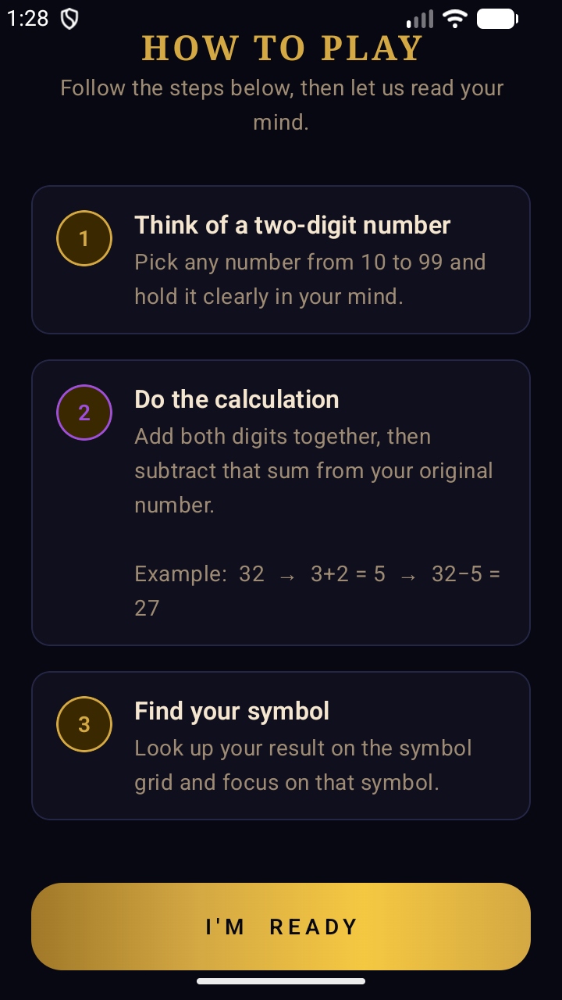
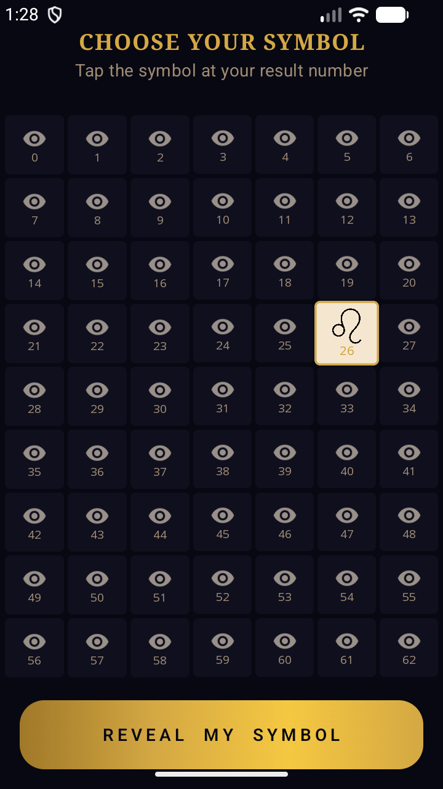
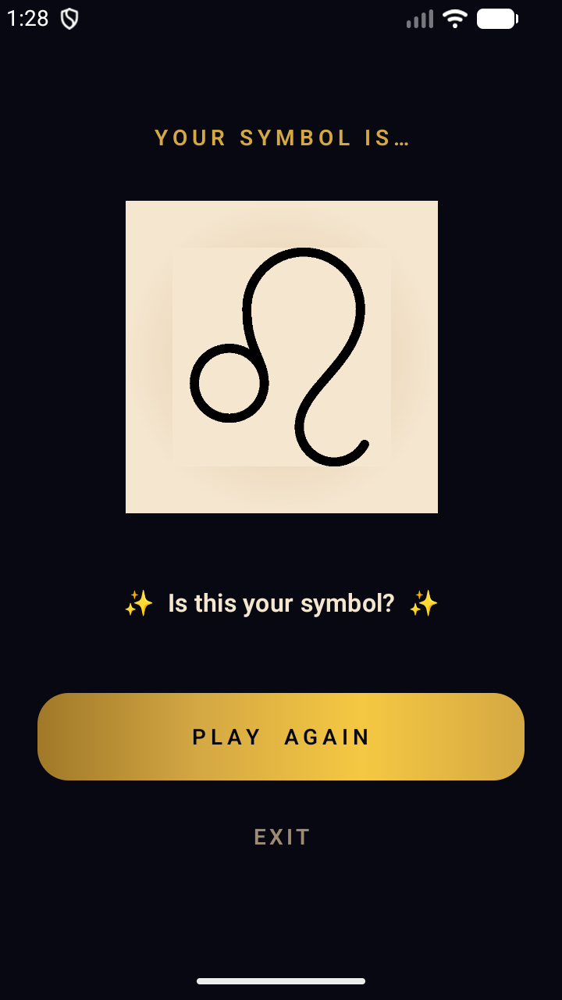

<p align="center">
  
</p>

<h1 align="center">Mind Reader</h1>

<p align="center">
  <em>A mystical card trick app that reads your mind</em>
</p>

<p align="center">
  
  
  
  
</p>

---

## About

Mind Reader is an Android app that performs a classic mathematical mind-reading trick. Think of any two-digit number, follow the steps, and the app will reveal the symbol you're thinking of — every single time.

### How It Works

1. Think of any two-digit number (10–99)
2. Subtract the sum of its digits from the number
3. Find your result on the symbol grid
4. The app reveals your symbol

## Screenshots

<p align="center">
  
  &nbsp;&nbsp;
  
  &nbsp;&nbsp;
  
  &nbsp;&nbsp;
  
</p>

<p align="center">
  <sub>Splash Screen &nbsp;&bull;&nbsp; Instructions &nbsp;&bull;&nbsp; Symbol Grid &nbsp;&bull;&nbsp; The Reveal</sub>
</p>

## Tech Stack

| Component | Technology |
|-----------|-----------|
| Language | Kotlin 2.2 |
| UI | Jetpack Compose (Material 3) |
| Architecture | ViewModel + StateFlow |
| Theme | Custom Mystic Dark (DeepVoid, AncientGold, MysticViolet) |
| Min SDK | 21 (Android 5.0) |
| Target SDK | 36 |
| Build | Gradle + AGP 8.6.0 |

## Build

```bash
# Debug build
./gradlew assembleDebug

# Release build
./gradlew assembleRelease

# Run tests
./gradlew test
```

## Project Structure

```
app/src/main/java/ml/fahimkhan/myapplication/
├── SplashScreen.kt          # Animated splash with star field
├── QuestionActivity.kt      # Step-by-step instructions
├── MainActivity.kt          # 7-column symbol grid
├── AnswerActivity.kt        # Dramatic symbol reveal
├── UpdateHelper.kt          # Google Play in-app updates
├── viewmodel/
│   └── GridViewModel.kt     # Grid state & shuffle logic
└── ui/
    ├── GoldButton.kt        # Reusable gold-gradient button
    └── theme/
        ├── Color.kt          # Mystic Dark palette
        ├── Theme.kt          # MindReaderTheme
        ├── Type.kt           # Typography (Serif + Monospace)
        └── Shape.kt          # Corner radius scale
```

## Download

<a href="https://play.google.com/store/apps/details?id=ml.fahimkhan.myapplication">
  
</a>

## License

Copyright 2025 Fahim Khan. All rights reserved.
